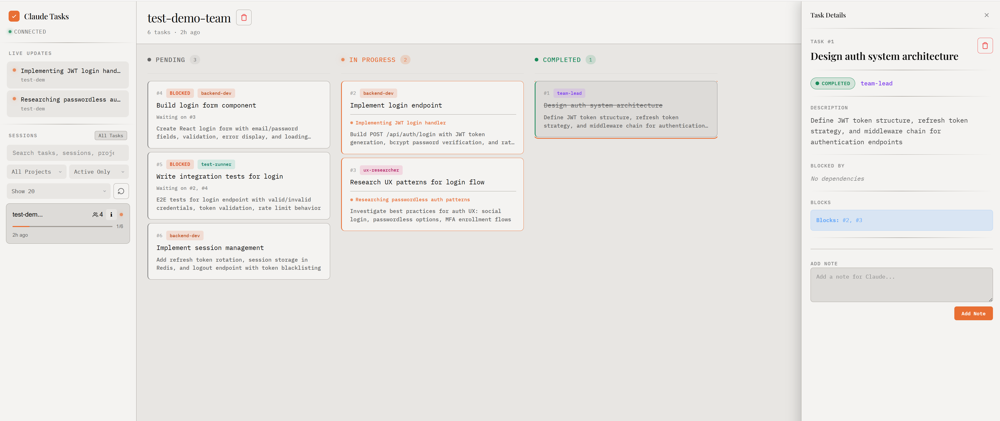
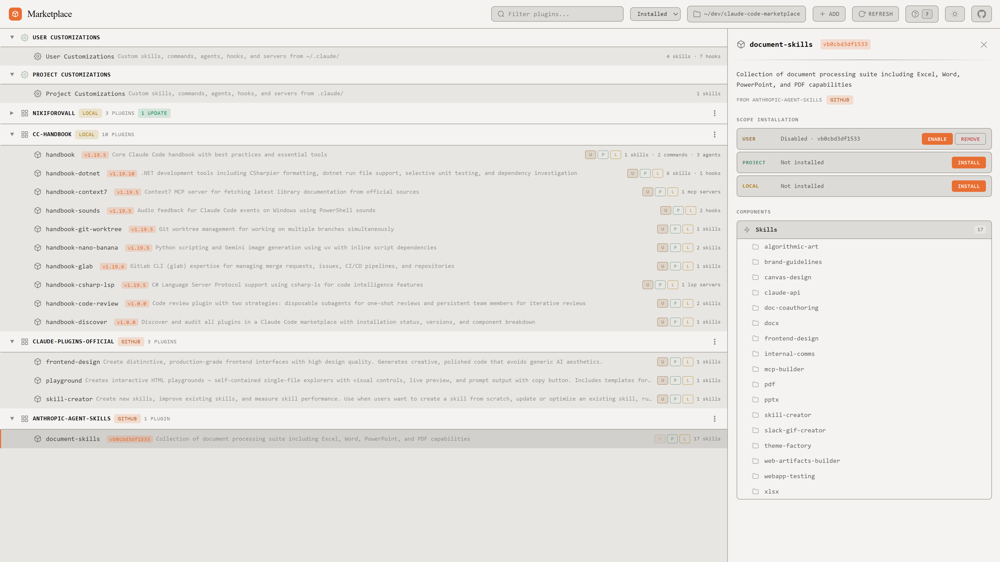
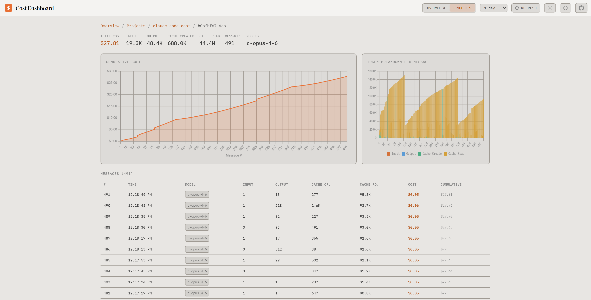
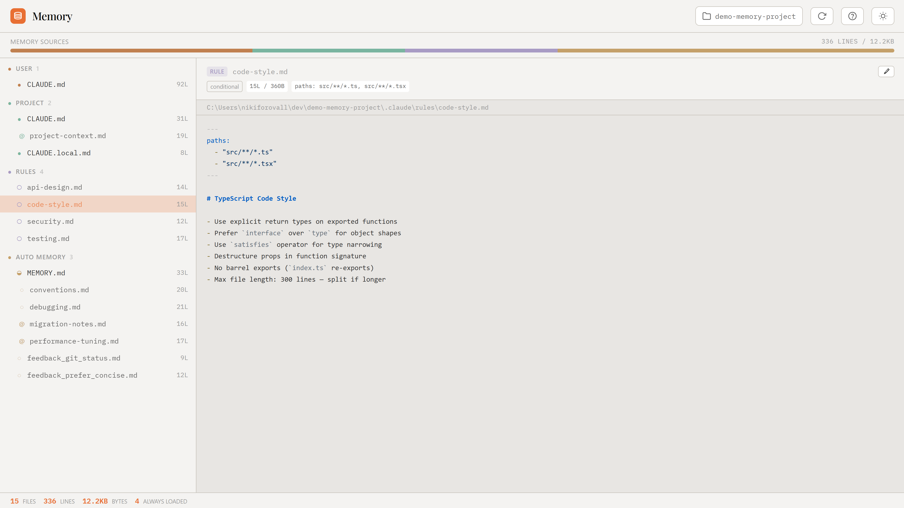

# Claude Code Hub

[](https://www.npmjs.com/package/claude-code-hub)
[](LICENSE)
[](https://www.npmjs.com/package/claude-code-hub)

Unified launcher for Claude Code tools — browse plugins in **Marketplace**, track tasks in **Kanban**, monitor costs in **Cost**, and explore memory in **Memory**, all from a single chromeless PWA.

## Kanban:



## Marketplace:


## Cost:


## Memory:


## Quick Start

```bash
npx claude-code-hub --open
```

### From Source

```bash
git clone --recurse-submodules https://github.com/NikiforovAll/claude-code-hub.git
cd claude-code-hub
npm install && npm install --prefix marketplace && npm install --prefix cck && npm install --prefix memory
npm start        # http://localhost:3455
```

## Agent Observability (one-time setup)

For the full Kanban experience — agent log, live subagent tracking, waiting-for-user indicators, and context window monitoring — install the hooks:

```bash
npx claude-code-kanban --install
```

Without hooks you still get the task board, but no agent activity or live indicators. See the [Kanban README](https://github.com/NikiforovAll/claude-task-viewer#getting-started) for details.

## Keyboard Shortcuts

| Shortcut         | Action                  |
| ---------------- | ----------------------- |
| `Alt+1`          | Switch to Kanban        |
| `Alt+2`          | Switch to Marketplace   |
| `Alt+3`          | Switch to Cost          |
| `Alt+4`          | Switch to Memory        |
| `Ctrl+M`         | Open Memory for current session (Kanban) |
| `Ctrl+Alt+Right` | Switch to next tool     |
| `Ctrl+Alt+Left`  | Switch to previous tool |

## How It Works

The hub server spawns both sub-apps as child processes, each on its own port. A minimal shell page embeds them in iframes and switches visibility on tab change — zero UI chrome, just keyboard shortcuts.

## Included Tools

| Tool                                                                   | Submodule      | Default Port |
| ---------------------------------------------------------------------- | -------------- | ------------ |
| [Marketplace](https://github.com/NikiforovAll/claude-code-marketplace) | `marketplace/` | 3457         |
| [Kanban](https://github.com/NikiforovAll/claude-task-viewer)           | `cck/`         | 3456         |
| [Cost](https://github.com/NikiforovAll/claude-code-cost)               | `cost/`        | 3458         |
| [Memory](https://github.com/NikiforovAll/claude-code-memory)           | `memory/`      | 3459         |

## CLI Flags

```
--port <n>              Hub port (default: 3455)
--marketplace-port <n>  Marketplace port (default: 3457)
--kanban-port <n>       Kanban port (default: 3456)
--cost-port <n>         Cost port (default: 3458)
--memory-port <n>       Memory port (default: 3459)
--open                  Auto-open browser
```

## License

MIT
