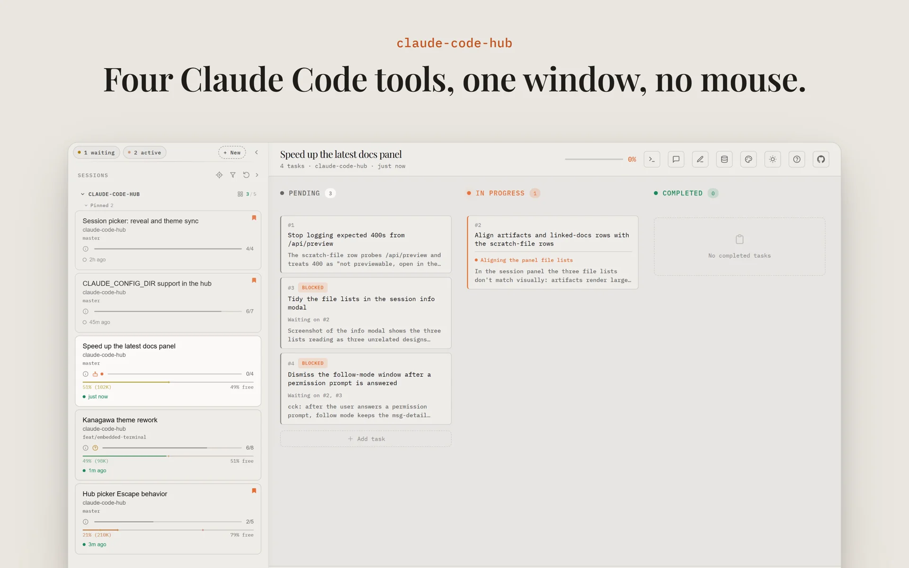
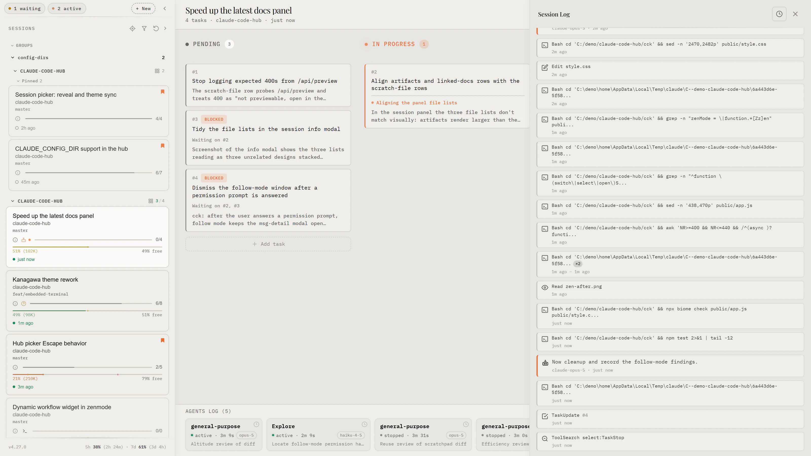
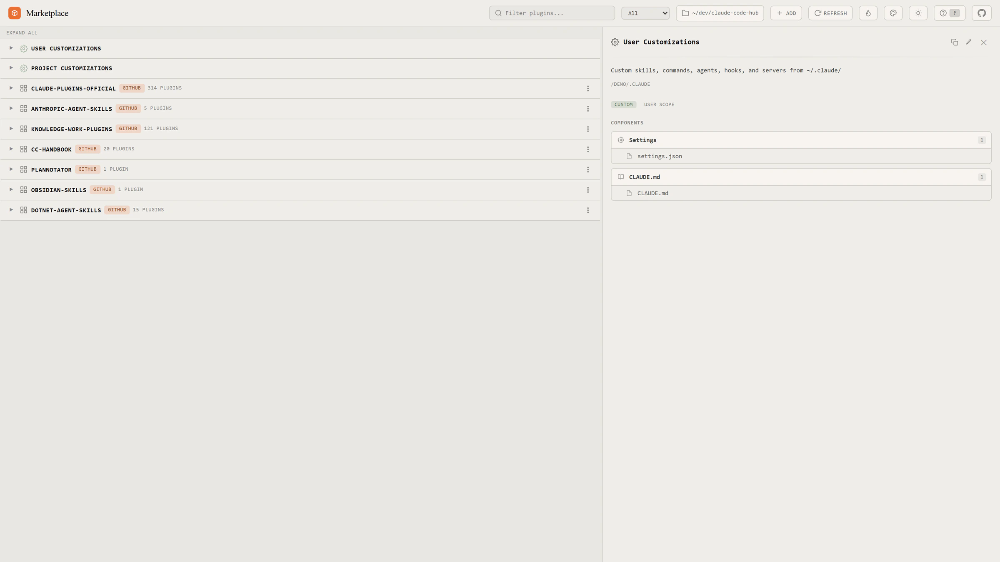
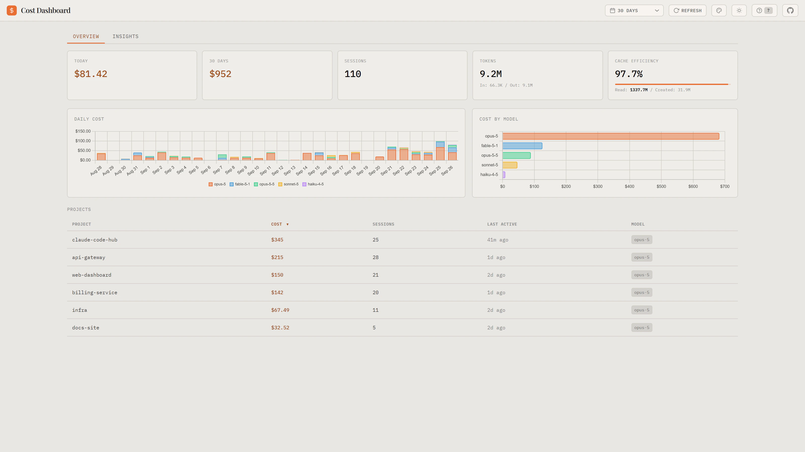
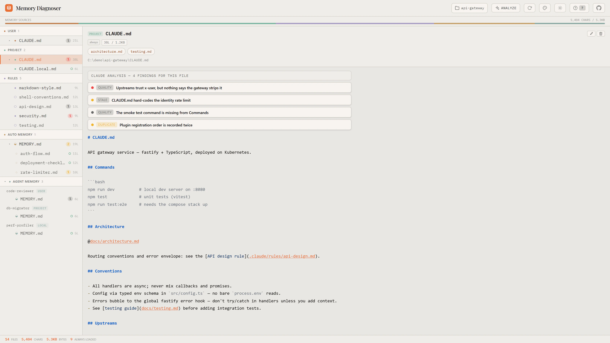

# Claude Code Hub

[](https://www.npmjs.com/package/claude-code-hub)
[](LICENSE)
[](https://www.npmjs.com/package/claude-code-hub)

One window for your Claude Code tools: Kanban, Marketplace, Cost, and Memory Diagnoser, in a single chromeless PWA that you drive from the keyboard.

Website: [nikiforovall.blog/claude-code-hub](https://nikiforovall.blog/claude-code-hub/)

<a href="https://youtu.be/9tMiNn1v6bY">
  <picture>
    <source media="(prefers-color-scheme: dark)" srcset="website/public/video/hub-dark.webp">
    
  </picture>
</a>

Watch the tour on YouTube: [light](https://youtu.be/9tMiNn1v6bY), [dark](https://youtu.be/avZk-3qOpWk).

## The tools

### Kanban

See tasks, sessions, and live agent activity as a board. Open a Claude Code session in the embedded terminal.

<picture>
  <source media="(prefers-color-scheme: dark)" srcset="assets/kanban-dark.webp">
  
</picture>

### Marketplace

Browse and manage Claude Code marketplace plugins.

<picture>
  <source media="(prefers-color-scheme: dark)" srcset="assets/marketplace-dark.webp">
  
</picture>

### Cost

See what your Claude Code usage costs, per session and per project.

<picture>
  <source media="(prefers-color-scheme: dark)" srcset="assets/cost-dark.webp">
  
</picture>

### Memory Diagnoser

Explore the memory files that Claude Code loads for a project.

<picture>
  <source media="(prefers-color-scheme: dark)" srcset="assets/memory-dark.webp">
  
</picture>

## Quick start

```bash
npm i -g claude-code-hub
claude-code-hub --open
```

The hub starts on `http://localhost:3540` and opens the browser. To get a window with no browser UI, install the page as an app from the browser menu. To update, run `npm i -g claude-code-hub@latest`.

To try the hub without installing it, run `npx claude-code-hub --open`. Each npx version runs from a different cache folder, so use a global install to keep the hub.

### From source

```bash
git clone --recurse-submodules https://github.com/NikiforovAll/claude-code-hub.git
cd claude-code-hub
npm install && npm install --prefix marketplace && npm install --prefix cck && npm install --prefix cost && npm install --prefix memory
npm start        # http://localhost:3540
```

## Agent observability (one-time setup)

For the full Kanban view (agent log, live subagent tracking, waiting-for-user indicators, and context window use), install the hooks:

```bash
npx claude-code-kanban --install
```

Without the hooks you still get the task board and sessions, but no live agent activity. The hooks and status line are installed per Claude config dir, so run the command again for each dir you use. See the [Kanban docs](https://nikiforovall.blog/claude-code-kanban/) for details.

## Hub token

The hub page and its API need a token. Any local account can reach a loopback port, and the API carries the terminal token.

- The token is in `~/.claude-hub/token`. The hub creates it on the first run and keeps it across restarts.
- The startup banner prints the URL with the token, `http://localhost:3540/?token=…`, and `--open` uses that URL. The hub sets a cookie and then removes the token from the address bar, so later visits and the installed app need no token.
- Without the token, the page shows a locked screen.
- To change the token, delete the file and restart the hub.

## Config dirs

The hub can run the tools against more than one Claude config dir (`CLAUDE_CONFIG_DIR`), for example a work dir and a personal dir.

- Press <kbd>Ctrl</kbd>+<kbd>Alt</kbd>+<kbd>W</kbd> to open the config-dir palette. Pick a dir to switch to it, or type a path to add a new one. <kbd>Ctrl</kbd>+<kbd>D</kbd> removes the selected dir.
- Each dir gets its own set of the four tools. When you switch, the hub keeps the old set running, so switching back is instant. `--pool-size` sets how many sets stay alive (default 3). When the pool is full, the hub stops the least recently used set, but not a set whose Kanban has open terminals.
- The list and the active dir are saved in `~/.claude-hub/config.json`.

## Choose the tools

By default the hub runs all four tools. To turn a tool off or change the tab order, add an `apps` list to `~/.claude-hub/config.json`:

```json
{
  "apps": [
    { "id": "kanban" },
    { "id": "cost" },
    { "id": "marketplace", "enabled": false }
  ]
}
```

- The ids are `kanban`, `marketplace`, `cost` and `memory`.
- The tools you list come first, in list order. The tools you do not list follow in the default order.
- A tool with `"enabled": false` does not start and gets no tab. Links from other tools to it do nothing.
- `"port": 4543` sets the tool's port. See [Ports](https://nikiforovall.blog/claude-code-hub/reference/configuration/#ports) for the order and the busy-port fallback.
- With Kanban off, the embedded terminal is off, and the project palette has no project list. You can still type a path.
- Restart the hub after you edit the file.

## Run a second hub

Give the second hub its own folder for the config file and token with `--hub-dir <path>` or `CLAUDE_HUB_DIR`. See [Run a second hub](https://nikiforovall.blog/claude-code-hub/reference/configuration/#run-a-second-hub).

## Embedded terminal

Under the hub, Kanban has an embedded terminal, on by default, so you can start or resume Claude Code sessions from the board. While a terminal is attached, the hub asks before it closes the window, because <kbd>Ctrl</kbd>+<kbd>W</kbd> meant for the terminal would close it.

To turn the terminal off, start the hub with `--disable-terminal`, or add this to `~/.claude-hub/config.json`:

```json
{
  "terminal": { "enabled": false }
}
```

## Keyboard shortcuts

The hub has no visible UI of its own. Use these shortcuts:

| Shortcut | Action |
| --- | --- |
| <kbd>Ctrl</kbd>+<kbd>Alt</kbd>+<kbd>→</kbd> | Next tool |
| <kbd>Ctrl</kbd>+<kbd>Alt</kbd>+<kbd>←</kbd> | Previous tool |
| <kbd>Alt</kbd>+<kbd>1</kbd> | Kanban |
| <kbd>Alt</kbd>+<kbd>2</kbd> | Marketplace |
| <kbd>Alt</kbd>+<kbd>3</kbd> | Cost |
| <kbd>Alt</kbd>+<kbd>4</kbd> | Memory Diagnoser |
| <kbd>Ctrl</kbd>+<kbd>Alt</kbd>+<kbd>P</kbd> | Project palette: set the project for all tools |
| <kbd>Ctrl</kbd>+<kbd>Alt</kbd>+<kbd>W</kbd> | Config-dir palette: switch, add, or remove a config dir |
| <kbd>Ctrl</kbd>+<kbd>Alt</kbd>+<kbd>A</kbd> | App launcher: switch to a tool, or restart it with <kbd>Ctrl</kbd>+<kbd>R</kbd> |

<kbd>Alt</kbd>+<kbd>1</kbd> to <kbd>Alt</kbd>+<kbd>4</kbd> follow the tab order, so they change when you [choose the tools](#choose-the-tools).

On macOS, every hub key is <kbd>Control</kbd>+<kbd>Option</kbd> with a key, the tool numbers too: <kbd>⌃⌥1</kbd> to <kbd>⌃⌥4</kbd>. <kbd>Option</kbd> with a digit types a character there, so the hub leaves it to the tools.

In a palette, use <kbd>↑</kbd>/<kbd>↓</kbd> or <kbd>Tab</kbd> to move, <kbd>Enter</kbd> to select, and <kbd>Esc</kbd> to close.

The shortcuts also work when focus is inside a tool. Kanban keeps <kbd>Ctrl</kbd>+<kbd>Alt</kbd>+<kbd>N</kbd> (new session), <kbd>Ctrl</kbd>+<kbd>Alt</kbd>+<kbd>R</kbd> (resume session), and <kbd>Ctrl</kbd>+<kbd>Alt</kbd>+<kbd>S</kbd> (previous session) for itself. From Kanban you can also jump to another tool for the selected session:

| Shortcut | Action |
| --- | --- |
| <kbd>M</kbd> | Open Marketplace for the session's project |
| <kbd>$</kbd> | Open Cost for the session |
| <kbd>Ctrl</kbd>+<kbd>M</kbd> | Open Memory Diagnoser for the session's project |

## CLI flags

```
--port <n>              Hub port (default: 3540)
--kanban-port <n>       Kanban port (default: 3541)
--marketplace-port <n>  Marketplace port (default: 3542)
--cost-port <n>         Cost port (default: 3543)
--memory-port <n>       Memory Diagnoser port (default: 3544)
--pool-size <n>         Config-dir sets kept running after a switch (default: 3)
--disable-terminal      Turn off the embedded terminal in Kanban
--host <addr>           Bind address (default: 127.0.0.1)
--allowed-hosts <list>  Extra host names to accept, comma-separated
--open                  Open the browser on start
--detached              Keep running when stdin closes (the macOS tray uses it)
--tray                  Windows, macOS: run the hub from a tray icon
--autostart             Windows, macOS: same as --tray, and start the tray at logon
--no-autostart          Windows, macOS: stop starting the tray at logon
--tray-status           Windows, macOS: show whether autostart is on and the tray and hub are running
--app-id <id>           Windows, macOS, with --tray or --autostart: the installed app that Open Hub starts
```

If a port is busy, the hub uses a free port and reports it.

## Tray icon (Windows, macOS)

```
claude-code-hub --autostart
```

The hub runs in the background with an icon in the notification area. Click the icon to open the hub. Right-click it to stop, start or restart the hub, open its log, turn **Start with Windows** on or off, or quit. The dot on the icon shows the state: green is running, amber is starting, red is stopped. If the hub stops unexpectedly, the tray shows a notice and turns red; start the hub again from the menu.

On macOS (experimental), the icon is in the menu bar.

To turn off autostart, untick **Start with Windows** or run `claude-code-hub --no-autostart`. To check the state, run `claude-code-hub --tray-status`. See [Run the hub from the tray](https://nikiforovall.blog/claude-code-hub/guides/tray/).

## Included tools

| Tool | Docs | Repo | Submodule | Default port |
| --- | --- | --- | --- | --- |
| Kanban | [Docs](https://nikiforovall.blog/claude-code-kanban/) | [claude-code-kanban](https://github.com/NikiforovAll/claude-code-kanban) | `cck/` | 3541 |
| Marketplace | [Docs](https://nikiforovall.blog/claude-code-marketplace/) | [claude-code-marketplace](https://github.com/NikiforovAll/claude-code-marketplace) | `marketplace/` | 3542 |
| Cost | [Docs](https://nikiforovall.blog/claude-code-cost/) | [claude-code-cost](https://github.com/NikiforovAll/claude-code-cost) | `cost/` | 3543 |
| Memory Diagnoser | [Docs](https://nikiforovall.blog/claude-code-memory/) | [claude-code-memory](https://github.com/NikiforovAll/claude-code-memory) | `memory/` | 3544 |

## License

MIT
